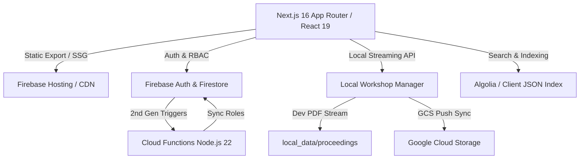

# HEMS Workshop Web Platform

Official web platform and historical research archive for the **Harbor & Environmental Mass Spectrometry (HEMS) Workshop** ([hems-workshop.org](http://www.hems-workshop.org)).

This platform serves as the central hub for workshop announcements, registration, call for papers, accommodations, and an interactive digital archive spanning over two decades of mass spectrometry proceedings (1999–2025).

---

## 🏛️ System Architecture



* **Frontend Framework:** Next.js 16 (App Router, Turbopack) with React 19, TypeScript 5, and Tailwind CSS v4.
* **Backend & Serverless:** Firebase Cloud Functions v2 (Node.js 22 runtime, 2nd Gen Firestore event triggers).
* **Database & Security:** Google Cloud Firestore with strict Role-Based Access Control (`admin`, `board`, `reviewer`, `general`), whitelist inheritance, and daily download quotas.
* **Storage & Proceedings:** Dual-mode asset routing supporting local development streaming (`/api/manager/serve`) and production Google Cloud Storage (`storage.googleapis.com`).
* **Deep Content Search:** Pre-compiled page-level searchable PDF chunk index and Algolia search integration.

---

## 📁 Repository Structure

```
HEMS-website/
├── .agents/                 # Antigravity Agile Release Train (ART) rules & personas
├── .github/workflows/       # GitHub Actions CI/CD (Firebase Hosting via WIF)
├── archive/legacy_tools/    # Retired scrapers and one-off migration utilities
├── docs/
│   ├── registries/          # Canonical SEO & 301 permalink registries
│   ├── plans/               # Permanent architectural sprint plans
│   └── logs/                # Silent Chain-of-Thought (SCoT) audit logs
├── local_data/              # Local proceedings & canonical sponsor assets
│   ├── proceedings/         # Workshop 1–15 proceedings (1,590 files, 1.68 GB)
│   └── sponsors/            # Master sponsor logo repository (91 assets)
├── firestore.rules          # Firestore security rules and RBAC policies
├── functions/               # Firebase Cloud Functions (Node.js 22, TypeScript)
│   └── src/index.ts         # Whitelist role synchronization triggers
└── src/
    └── frontend/            # Next.js web application
        ├── public/          # Static assets & pre-compiled search indices
        ├── scripts/         # Production build and GCS push scripts
        └── src/
            ├── app/         # App Router pages & portals
            │   ├── (portal)/# Role-gated areas (Admin, Board, Reviewer)
            │   ├── archive/ # Dynamic 1999-2025 proceedings viewer
            │   ├── manager/ # Local Workshop Manager workbench
            │   └── api/     # Local dev APIs (PDF streaming, save, sync)
            ├── components/  # Modular UI components
            └── data/        # Master JSON datasets and workshop archives
```

---

## 🚀 Getting Started

### Prerequisites
* **Node.js:** v20+ or v22+
* **npm:** v10+

### Local Development

1. **Install Dependencies:**
   ```bash
   cd src/frontend
   npm install
   ```

2. **Start the Development Server:**
   ```bash
   npm run dev
   ```
   * **Public Website:** [http://localhost:3000](http://localhost:3000)
   * **Workshop Manager:** [http://localhost:3000/manager](http://localhost:3000/manager)

During local development, the Workshop Manager and archive viewer automatically stream local presentation PDFs and abstracts directly from `local_data/proceedings/`.

---

## 🛠️ Build & Deployment

### Production Build
To validate TypeScript types, pre-compile search indices, and generate the static export:
```bash
cd src/frontend
npm run build
```
Output is compiled to `src/frontend/out/`.

### Cloud Storage Asset Sync
To synchronize newly processed local proceedings and presentation PDFs with Google Cloud Storage:
```bash
cd src/frontend
npm run push-to-live
```

### Continuous Deployment
The repository is configured with GitHub Actions (`.github/workflows/firebase-hosting-merge.yml`). Merges or pushes to the `main` branch automatically execute static compilation and deploy to **Firebase Hosting** using Google Workload Identity Federation (WIF).
