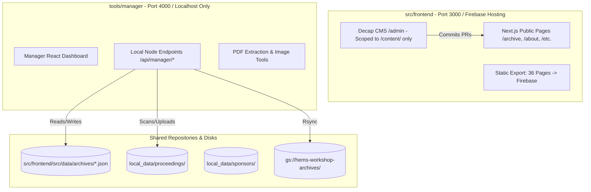

# Architecture Plan: Decoupling Workshop Manager into a Standalone Local Tool

## 1. Context & Objective
The HEMS Workshop Manager is an internal operational console used to inspect proceedings, extract OCR text, catalog slide decks, register sponsor logos, and sync archives to Google Cloud Storage. Currently, it resides inside `src/frontend/src/app/manager` and relies on a build-time file-renaming hack (`build-prod.js` renaming files to `.disabled`) to prevent it from leaking into the Firebase Hosting production bundle.

To enable customer access to website text via **Decap CMS** without compromising master proceedings or exposing internal tools, we will **decouple the Workshop Manager into a dedicated, standalone local tool** located in `tools/manager/` running independently on `http://localhost:4000`.

---

## 2. Target Architecture Overview

---

## 3. Step-by-Step Implementation Strategy

### Phase 1: Establish `tools/manager/` Environment
1. Initialize a lightweight Next.js app in `tools/manager/` configured specifically for local operations:
   * Fixed port: `4000` (e.g. `next dev -p 4000`).
   * Minimal dependencies: `react`, `react-dom`, `next`, `lucide-react`, `pdf-parse`, `jspdf`.
2. Migrate all 8 manager UI components and the main dashboard:
   * Source: `src/frontend/src/app/manager/*`
   * Target: `tools/manager/src/app/page.tsx` and `tools/manager/src/components/*`
3. Migrate all 11 manager API routes:
   * Source: `src/frontend/src/app/api/manager/*`
   * Target: `tools/manager/src/app/api/manager/*`

### Phase 2: Calibrate Relative Paths for Standalone Tool
Update the backend API endpoints in `tools/manager/` to point to the shared repository directories:
* **Archives JSON:** `path.resolve(process.cwd(), '../../src/frontend/src/data/archives')`
* **Local Proceedings:** `path.resolve(process.cwd(), '../../local_data/proceedings')`
* **Local Sponsors:** `path.resolve(process.cwd(), '../../local_data/sponsors')`
* **Registries:** `path.resolve(process.cwd(), '../../docs/registries')`

### Phase 3: Sanitize and Streamline Public Frontend (`src/frontend/`)
1. **Remove Manager from Frontend:**
   * Delete `src/frontend/src/app/manager/`
   * Delete `src/frontend/src/app/api/manager/`
2. **Eliminate Build Hacks:**
   * Simplify `src/frontend/scripts/build-prod.js`: Remove `toggleManagerFiles()` and `.disabled` file-renaming routines.
   * Public builds become standard, clean, and instant `next build` commands.
   * Windows file lock issues are permanently resolved.

### Phase 4: Root Developer Tooling & Ergonomics
Add simple npm scripts to the root `package.json` so you can launch either or both servers with one command:
* `npm run dev`: Starts the public website on `http://localhost:3000`.
* `npm run manager`: Starts the workshop manager on `http://localhost:4000`.

---

## 4. Decap CMS Security & Isolation Guarantee
Once this architecture is in place:
1. **Physical Separation:** The public website repository contains zero manager code, zero local file-scanning APIs, and zero administrative backdoors.
2. **Decap CMS Sandbox Boundary:** Decap CMS can be configured in `src/frontend/public/admin/` to only edit flat Markdown marketing pages in `src/frontend/content/`.
3. **Impossibility of Tampering:** Even if a client inspects the frontend code or uses Decap CMS, it is physically impossible for them to access, modify, or break the Manager or master proceeding catalogs.

---

## 5. Verification & Acceptance Criteria
1. **Manager Functional Parity:**
   * Launch `npm run manager` on `http://localhost:4000`.
   * Verify loading all 15 workshops (1999–2025).
   * Verify file inspection, PDF thumbnail preview generation, and sponsor logo management.
   * Verify saving a change writes cleanly to `src/frontend/src/data/archives/` and appears in the public site.
2. **Frontend Production Build:**
   * Run `npm --prefix src/frontend run build`.
   * Confirm 36/36 static pages generate without any `.disabled` file manipulation.
3. **Decap CMS Verification:**
   * Confirm Decap CMS test environment remains isolated with zero visibility into `tools/manager/`.
