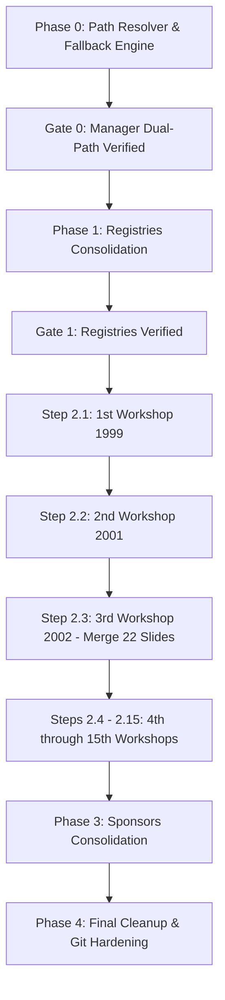

# Granular Implementation Plan: Workshop-by-Workshop Local Data Reorganization

This plan structures the local proceedings and registry reorganization into **discrete, verifiable checkpoints**—allowing **@bo** to inspect and verify progress **one workshop archive at a time**.

---

## User Review Required

> [!IMPORTANT]
> - **Zero-Downtime Dual-Path Engine (Phase 0):** Before moving files, we deploy [`assetPaths.ts`](file:///c:/AntigravityP1_2/HEMS-website/src/frontend/src/utils/assetPaths.ts). It resolves paths from `local_data/proceedings/[ws]` first, and automatically falls back to `docs/archives_translation/proceedings/[ws]`. The Workshop Manager continues working uninterrupted during partial migration.
> - **1 Workshop at a Time (Phase 2):** Each of the 15 workshop archives is processed, deduplicated under the **Manager Reference Authority Protocol**, and verified individually.
> - **Storage Reclaimed:** Each migrated workshop folder immediately deletes its redundant copy in `proceedings_backup/`, progressively freeing up **1.71 GB**.

---

## Phased Workflow & Checkpoint Architecture

---

## Detailed Step-by-Step Breakdown

### Phase 0: Centralized Path Architecture & Fallback Engine
Deploy the dual-path resolution module so both old and new locations function concurrently:

#### [NEW] [`src/frontend/src/utils/assetPaths.ts`](file:///c:/AntigravityP1_2/HEMS-website/src/frontend/src/utils/assetPaths.ts)
* `getProceedingsDir()`: Resolves to `local_data/proceedings` with fallback to `docs/archives_translation/proceedings`.
* `getWorkshopDir(wsOrdinal)`: Checks `local_data/proceedings/${wsOrdinal}` first; if missing, returns `docs/archives_translation/proceedings/${wsOrdinal}`.
* `getSponsorsDir()`: Resolves to `local_data/sponsors` with fallback.
* `getRegistriesDir()`: Resolves to `docs/registries`.

#### [MODIFY] Refactor Manager API routes to use `assetPaths.ts`:
* [`serve/route.ts`](file:///c:/AntigravityP1_2/HEMS-website/src/frontend/src/app/api/manager/serve/route.ts), [`upload/route.ts`](file:///c:/AntigravityP1_2/HEMS-website/src/frontend/src/app/api/manager/upload/route.ts), [`save/route.ts`](file:///c:/AntigravityP1_2/HEMS-website/src/frontend/src/app/api/manager/save/route.ts), [`push-to-live/route.ts`](file:///c:/AntigravityP1_2/HEMS-website/src/frontend/src/app/api/manager/push-to-live/route.ts), [`preview/route.ts`](file:///c:/AntigravityP1_2/HEMS-website/src/frontend/src/app/api/manager/preview/route.ts), [`download-legacy/route.ts`](file:///c:/AntigravityP1_2/HEMS-website/src/frontend/src/app/api/manager/download-legacy/route.ts), [`delete/route.ts`](file:///c:/AntigravityP1_2/HEMS-website/src/frontend/src/app/api/manager/delete/route.ts), [`check-file/route.ts`](file:///c:/AntigravityP1_2/HEMS-website/src/frontend/src/app/api/manager/check-file/route.ts).
* Scripts: [`push-to-live.js`](file:///c:/AntigravityP1_2/HEMS-website/src/frontend/scripts/push-to-live.js), [`index-pdf-contents.js`](file:///c:/AntigravityP1_2/HEMS-website/src/frontend/scripts/index-pdf-contents.js).

**Gate 0 Checkpoint:** Confirm Workshop Manager at `http://localhost:3000/manager` loads existing files without error.

---

### Phase 1: Registries Hub Consolidation
1. **[NEW] Directory:** `docs/registries/`
2. **[MOVE] Permalink Registry:** `docs/archives_translation/proceedings/redirect_map.json` -> [`docs/registries/permalink_registry.json`](file:///c:/AntigravityP1_2/HEMS-website/docs/registries/permalink_registry.json).
3. **[MOVE] SEO Metadata Registry:** `docs/design/pdf_seo_registry.md` -> [`docs/registries/pdf_seo_registry.md`](file:///c:/AntigravityP1_2/HEMS-website/docs/registries/pdf_seo_registry.md).
4. Update paths in `pdf_seo_registry.md` to reference `local_data\proceedings\...`.

**Gate 1 Checkpoint:** Inspect `docs/registries/` in IDE.

---

### Phase 2: Granular Workshop-by-Workshop Migration (15 Discrete Steps)

Each workshop follows a 4-point protocol:
1. **Audit:** Scan `master_workshops.json` & `archives/*.json` for all referenced files in this workshop.
2. **Deduplicate:** Reconcile `proceedings/[N]th` vs `proceedings_backup/[N]th` (Manager-referenced version is strictly retained).
3. **Move:** Relocate `proceedings/[N]th` -> `local_data/proceedings/[N]th`.
4. **Prune Backup:** Delete `proceedings_backup/[N]th`.

| Step | Workshop | Year | File Count | Size | Special Notes | Checkpoint |
| :--- | :--- | :--- | :--- | :--- | :--- | :--- |
| **2.1** | **1st Workshop** | 1999 | 2 files | 0.07 MB | Quick pilot test | [Gate 2.1: Verify 1999 in Manager](http://localhost:3000/manager) |
| **2.2** | **2nd Workshop** | 2001 | 52 files | 0.41 MB | First full oral/poster catalog | [Gate 2.2: Verify 2001 in Manager](http://localhost:3000/manager) |
| **2.3** | **3rd Workshop** | 2002 | 137 files | 20.1 MB | Merge 22 unique slides from backup | [Gate 2.3: Verify 2002 in Manager](http://localhost:3000/manager) |
| **2.4** | **4th Workshop** | 2003 | 44 files | 38.3 MB | Keynote & session papers | [Gate 2.4: Verify 2003 in Manager](http://localhost:3000/manager) |
| **2.5** | **5th Workshop** | 2005 | 130 files | 44.3 MB | Expanded technical sessions | [Gate 2.5: Verify 2005 in Manager](http://localhost:3000/manager) |
| **2.6** | **6th Workshop** | 2007 | 130 files | 71.9 MB | Full oral presentation set | [Gate 2.6: Verify 2007 in Manager](http://localhost:3000/manager) |
| **2.7** | **7th Workshop** | 2009 | 228 files | 153.9 MB | High volume session files | [Gate 2.7: Verify 2009 in Manager](http://localhost:3000/manager) |
| **2.8** | **8th Workshop** | 2011 | 166 files | 110.4 MB | Poster & oral proceedings | [Gate 2.8: Verify 2011 in Manager](http://localhost:3000/manager) |
| **2.9** | **9th Workshop** | 2013 | 132 files | 22.5 MB | Technical proceedings | [Gate 2.9: Verify 2013 in Manager](http://localhost:3000/manager) |
| **2.10**| **10th Workshop**| 2015 | 106 files | 142.7 MB | Heavy presentation slide sets | [Gate 2.10: Verify 2015 in Manager](http://localhost:3000/manager) |
| **2.11**| **11th Workshop**| 2017 | 104 files | 118.9 MB | Student award winning talks | [Gate 2.11: Verify 2017 in Manager](http://localhost:3000/manager) |
| **2.12**| **12th Workshop**| 2018 | 40 files | 94.2 MB | Streamlined sessions | [Gate 2.12: Verify 2018 in Manager](http://localhost:3000/manager) |
| **2.13**| **13th Workshop**| 2019 | 124 files | 721.4 MB | Largest media payload (721 MB) | [Gate 2.13: Verify 2019 in Manager](http://localhost:3000/manager) |
| **2.14**| **14th Workshop**| 2022 | 79 files | 74.9 MB | Modern session format | [Gate 2.14: Verify 2022 in Manager](http://localhost:3000/manager) |
| **2.15**| **15th Workshop**| 2025 | 94 files | 104.0 MB | Latest workshop archive | [Gate 2.15: Verify 2025 in Manager](http://localhost:3000/manager) |

---

### Phase 3: Sponsors Asset Consolidation
1. Move `docs/archives_translation/sponsors/` -> `local_data/sponsors/`.
2. **Gate 3 Checkpoint:** Verify sponsor logos display in Workshop Manager and corporate registry.

---

### Phase 4: Final Cleanup & Git Hardening
1. Remove now-empty legacy directories: `docs/archives_translation/proceedings/`, `proceedings_backup/`, `raw_html/`, and parent `docs/archives_translation/`.
2. Update [`.gitignore`](file:///c:/AntigravityP1_2/HEMS-website/.gitignore) to replace `docs/archives_translation/*/` with `local_data/`.
3. Update [`README.md`](file:///c:/AntigravityP1_2/HEMS-website/README.md) with the finalized `local_data/` architecture.
4. Run full production build verification (`npm run build` in `src/frontend` and `functions`).
5. **Gate 4 Checkpoint:** Confirm 0 build errors and clean Git status.

---

## Verification Plan

### Automated Tests
- Per-workshop reference cross-audit script prior to each step.
- `npm --prefix src/frontend run build`
- `npm --prefix functions run build`

### Manual Verification
- At each gate, open [http://localhost:3000/manager](http://localhost:3000/manager) and expand that specific workshop to confirm all green checks, previews, and PDF streaming.
