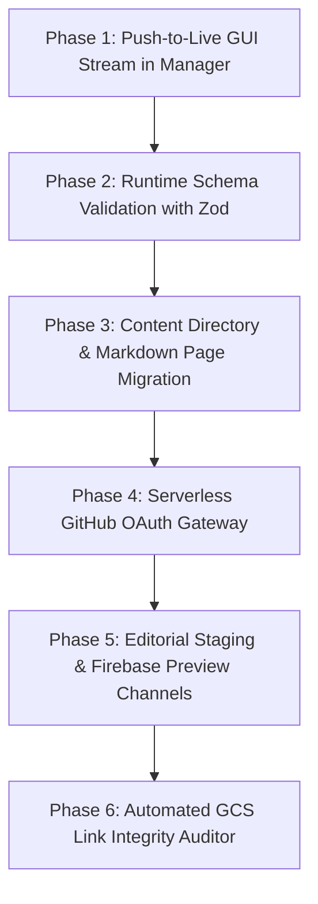

# Architecture Plan: System Architecture Improvements & Decap CMS Implementation

## 1. Context & Executive Objective
Following the successful decoupling of the **HEMS Workshop Manager** into a dedicated local workstation tool ([`tools/manager/`](file:///c:/AntigravityP1_2/HEMS-website/tools/manager) on port 4000), this document defines a step-wise roadmap to implement five major architectural improvements.

A primary mandate of this plan is to **explicitly define the security and content perimeter for Decap CMS**, guaranteeing that client editing access is strictly confined to marketing copy while master proceedings archives, registries, and operational tooling remain completely locked and untouchable.

---

## 2. Decap CMS Access Matrix (Strict Content Scoping)

Decap CMS will be configured via its collection schemas to have **access ONLY to flat Markdown documents** residing inside a new dedicated `src/frontend/content/` directory.

### ✅ PAGES EXPOSED TO DECAP CMS (Client Accessible)
The customer will be granted access to edit the following **8 content collections**:

| # | Public Page Route | Content Source File | Content Managed by Client |
| :- | :--- | :--- | :--- |
| **1** | `/about` | `src/frontend/content/pages/about.md` | Society mission, history overview, executive leadership summary, workshop narrative. |
| **2** | `/call-for-papers` | `src/frontend/content/pages/call-for-papers.md` | Current workshop edition, abstract submission deadlines, focus topics, submission instructions, submission open/closed toggle. |
| **3** | `/accommodations` | `src/frontend/content/pages/accommodations.md` | Hotel name, street address, map URL, reservation cut-off date, group discount code, airport/ground transportation info. |
| **4** | `/registration` | `src/frontend/content/pages/registration.md` | Attendee pricing schedule (Regular, Student, Exhibitor), payment instructions, cancellation terms, registration portal URL. |
| **5** | `/formatting-guidelines` | `src/frontend/content/pages/formatting-guidelines.md` | Extended abstract format specifications, font sizes, page limits, presentation slide dimensions. |
| **6** | `/corporate-sponsorship` | `src/frontend/content/pages/corporate-sponsorship.md` | Annual sponsorship packages (Platinum, Gold, Silver), exhibitor booth descriptions, sponsor prospectus link. |
| **7** | `/contact` | `src/frontend/content/pages/contact.md` | General society email, physical mailing address, workshop chair contact notes. |
| **8** | `/announcements` | `src/frontend/content/announcements/*.md` | Urgent banner alerts (e.g. *"Deadline extended"*), conference news posts, keynote speaker spotlights. |

---

### ❌ PAGES & ASSETS STRICTLY OFF-LIMITS TO DECAP CMS (Hard-Locked)
The following areas are **physically excluded from `config.yml`** and are completely invisible and inaccessible to Decap CMS:

1. 🛑 **Workshop Archives (`/archive` and `/archive/[year]`):**
   * Stored in `src/frontend/src/data/archives/*.json` and `master_workshops.json`.
   * Managed exclusively through the local Workshop Manager on port 4000.
2. 🛑 **Executive Board Directory (`/board`):**
   * Curated board member roster with specific governance titles and academic credentials.
3. 🛑 **Student Awards Archive (`/student-awards`):**
   * Historical competitive scholarship rolls from 1999–2025.
4. 🛑 **Operational Workbench (`tools/manager/`):**
   * Resides in a separate local directory outside the frontend tree, completely invisible to the CMS.
5. 🛑 **Cloud Storage Binaries (`local_data/` and `gs://hems-workshop-archives/`):**
   * 1.68 GB of master conference PDFs, PPTs, and OCR thumbnails.
6. 🛑 **System Infrastructure & Environment Keys:**
   * `.env`, `firebase.json`, `firestore.rules`, `.github/workflows/`, and build scripts.

---

## 3. Step-Wise Implementation Roadmap

### Phase 1: Push-to-Live GUI Stream in the Manager (Immediate Quick Win)
* **Rationale:** Because `tools/manager` now runs on port 4000 independently of the public frontend (port 3000), building the frontend no longer locks the manager.
* **Actions:**
  1. Update `tools/manager/src/app/api/manager/push-to-live/route.ts` to execute `gsutil rsync`, `git add/commit/push`, and `npm run build` asynchronously.
  2. Implement a streaming log endpoint using Server-Sent Events (SSE) so terminal output streams live directly into the Manager UI console.
  3. Re-enable the green **"Push to Live"** button in `tools/manager/src/app/page.tsx`.

### Phase 2: Runtime Schema Validation with Zod (Catalog Hardening)
* **Rationale:** Prevent data corruption, syntax errors, or missing fields in JSON files from breaking Next.js static builds.
* **Actions:**
  1. Create `src/frontend/src/schemas/archive.schema.ts` defining strict TypeScript/Zod schemas:
     * `PresentationSchema` (validates `title`, `authors[]`, `session`, `files`).
     * `WorkshopArchiveSchema` (validates `year`, `ordinal`, `tagline`, `host_corporation`, `sponsors[]`).
     * `MasterWorkshopsSchema` (validates global workshop list).
  2. Integrate pre-flight validation in:
     * `tools/manager/src/app/api/manager/save/route.ts` (validates before saving to disk).
     * `src/frontend/scripts/build-prod.js` (validates all 15 JSON files before Next.js builds).

### Phase 3: Content Directory Structure & Marketing Page Migration
* **Rationale:** Decouple marketing page text from React TSX code into structured Markdown files with frontmatter so Decap CMS can edit them cleanly.
* **Actions:**
  1. Create `src/frontend/content/pages/` and `src/frontend/content/announcements/`.
  2. Extract text from `/about`, `/call-for-papers`, `/accommodations`, `/registration`, `/formatting-guidelines`, `/corporate-sponsorship`, and `/contact` into Markdown files with YAML frontmatter.
  3. Update the corresponding Next.js page components to parse and render their content from Markdown at static build time.
  4. Create `src/frontend/public/admin/config.yml` configured strictly for these 8 collections.

### Phase 4: Serverless GitHub OAuth Gateway for Decap CMS
* **Rationale:** Decap CMS requires an OAuth backend to exchange GitHub login tokens securely without exposing client secrets or relying on Netlify.
* **Actions:**
  1. Register a GitHub OAuth Application (e.g. `HEMS Content Manager`).
  2. Add a lightweight serverless OAuth exchange function in `functions/` (or a Next.js API route):
     * `GET /api/auth`: Redirects editor to GitHub OAuth consent.
     * `GET /api/callback`: Exchanges authorization code for an access token and returns it to Decap CMS via postMessage.
  3. Store `GITHUB_CLIENT_ID` and `GITHUB_CLIENT_SECRET` securely in Google Secret Manager / Firebase Config.

### Phase 5: Editorial Staging & Firebase Preview Channels
* **Rationale:** Protect production `main` from unverified client edits.
* **Actions:**
  1. Configure Decap CMS with `publish_mode: editorial_workflow` targeting a `cms-staging` branch.
  2. Create a GitHub Actions workflow:
     * Triggers whenever the client saves a draft in Decap CMS.
     * Builds and deploys a temporary **Firebase Hosting Preview Channel**:
       `firebase hosting:channel:deploy staging-preview`
     * Comments the live preview link on the draft PR so you and the client can review the rendered page before merging.

### Phase 6: Automated GCS Link Integrity Auditor (`npm run audit:assets`)
* **Rationale:** Continuously ensure that all 436 catalog papers and slide decks hosted in Google Cloud Storage resolve to HTTP 200 OK.
* **Actions:**
  1. Create `scripts/audit-proceedings-assets.js`.
  2. Scans all 15 workshop catalogs in `src/frontend/src/data/archives/*.json`.
  3. Concurrently issues HTTP HEAD requests against `https://storage.googleapis.com/hems-workshop-archives/proceedings/...`.
  4. Outputs a formatted terminal table highlighting healthy links vs. any broken or missing assets.

---

## 4. Verification & Acceptance Criteria
1. **Push-to-Live GUI:** Clicking "Push to Live" in the Manager on `http://localhost:4000` successfully runs GCS rsync and Git push, displaying live logs in the console without terminal switching.
2. **Schema Hardening:** Corrupting a field in `2022.json` intentionally triggers an instant, informative validation error before `npm run build` executes.
3. **Decap CMS Containment:** Verifying `http://localhost:3000/admin` shows only the 8 marketing collections and cannot browse or touch `data/archives` or `tools/manager`.
4. **Link Audit:** Running `npm run audit:assets` audits all 436 paper assets and reports 100% resolution.
